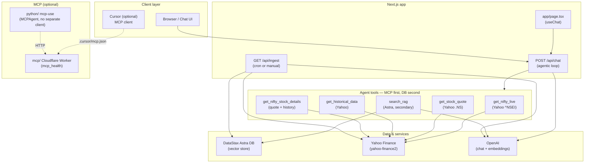
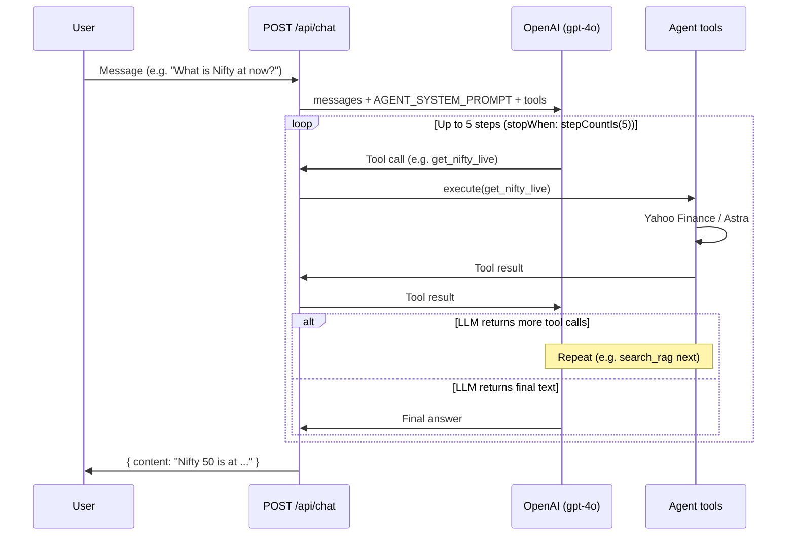

# NiftyRAG

Production-ready **RAG chatbot** for real-time **NSE Nifty 50** stock analysis. Built with Next.js 15, Vercel AI SDK, **OpenAI** (chat + embeddings), and DataStax Astra DB (vector store).

## Features

- **Chat UI** with streaming responses (Tailwind + shadcn-style components)
- **Data source**: **Yahoo Finance** for real Nifty 50 index (^NSEI) and Nifty 50 stocks (TCS, Reliance, HDFC Bank, Infosys, etc.) — no API key
- **MCP first, database second**: every search hits live tools (Nifty index, stock quote, history) first; Astra DB is used only as a supplement for stored forecasts and key levels
- **Any Nifty searchable**: Nifty 50 index and all 50 constituent stocks (by name or symbol); live quote, history, and full details in one place
- **Auto-load on first prompt**: if the vector index is empty, the first chat request triggers ingest once, then answers using the new data
- **Daily ingest**: Yahoo Finance (Nifty 50 index + stocks) + NSE RSS + fallback mock → chunk → embed → upsert to Astra
- **Vercel Cron**: daily refresh at 6:00 UTC (`/api/ingest`) so the knowledge base stays up to date
- **Demo queries**: e.g. "Nifty 50 forecast Feb 2026", "Reliance recent performance?"

## Architecture

High-level components and how they connect:



## Chat flow (agentic loop)

How a user question becomes an answer:



**MCP first, DB second:** The prompt instructs the LLM to call live tools (`get_nifty_live`, `get_stock_quote`, `get_historical_data`, `get_nifty_stock_details`) first for any Nifty/stock query; `search_rag` is used only as a supplement for stored context.

## Setup

### 1. Clone and install

```bash
cd RaG
npm install
```

### 2. Environment variables

Copy `.env.example` to `.env.local` and fill in:

| Variable | Description |
|----------|-------------|
| `OPENAI_API_KEY` | **Required.** OpenAI API key for **chat** (gpt-4o etc.) and **embeddings** (text-embedding-3-small) |
| `OPENAI_CHAT_MODEL` | (Optional) Chat model; default `gpt-4o`. Others: gpt-4.1-mini, gpt-4.1-nano, gpt-5-mini, gpt-5-nano, o4-mini |
| `ASTRA_DB_API_ENDPOINT` | DataStax Astra DB Serverless endpoint (e.g. `https://<id>-<region>.apps.astra.datastax.com`) |
| `ASTRA_DB_APPLICATION_TOKEN` | Astra application token |
| `ALPHA_VANTAGE_API_KEY` | (Optional) Only for [Alpha Vantage MCP](https://mcp.alphavantage.co/) in Cursor; not used by the app or ingest. |
| `CRON_SECRET` | (Optional) Secret for securing cron-triggered ingest on Vercel |

Nifty 50 and stock data come from **Yahoo Finance** (no API key). NSE RSS is fetched when available; mock data is used only if Yahoo fails. Live data in chat is always from the MCP-style tools (Yahoo), with the database as supplement.

Do not commit `.env.local`.

### 3. Astra DB (free tier)

1. Create a [Serverless (vector) database](https://astra.datastax.com/).
2. Create an application token with **Database Administrator** (or sufficient permissions).
3. Copy **Data API endpoint** and **token** into `.env.local`.

### 4. Run locally

```bash
npm run dev
```

Open [http://localhost:3000](http://localhost:3000). Set `OPENAI_API_KEY` for chat and embeddings. For **RAG** (context from Nifty data), also set Astra env vars and run ingest once.

### 5. Test the pipeline (step-by-step)

Validate each part before relying on the full RAG in the UI:

1. **Embeddings:** `npm run test:embeddings` (needs `OPENAI_API_KEY`)
2. **Model:** `npm run test:model` (needs `OPENAI_API_KEY`)
3. **RAG:** `npm run test` to run all tests (Astra tests skip if env not set)

See [tests/README.md](tests/README.md) for details.

### 6. Ingest data (for RAG)

With Astra + OpenAI configured:

- **Automatic on first prompt**: The first time you ask a question, if the index is empty, the app runs ingest once and then answers (no need to click "Load Nifty data" unless you prefer).
- **Manual**: `npm run ingest` or **Load Nifty data** in the UI
- **HTTP**: `GET /api/ingest` (optional: `Authorization: Bearer <CRON_SECRET>`)
- **Scheduled (recommended)**: Vercel Cron runs `GET /api/ingest` daily at 6:00 UTC so data stays fresh.

## How RAG works (and why a daily crawl helps)

**RAG (Retrieval Augmented Generation)** in this app:

1. **Indexing (ingest)**  
   Documents (Yahoo Finance Nifty 50 + stocks, NSE RSS, and fallback mock) are split into chunks, embedded with OpenAI, and stored in Astra DB. The vector index is a snapshot of what was ingested.

2. **At query time**  
   The user question is embedded, Astra returns the top-8 most similar chunks (cosine similarity), and those chunks are added to the LLM system prompt. The model answers using that context and cites sources.

3. **Freshness**  
   The model only “sees” what’s in the index. If you never re-run ingest, the context stays old. For Nifty levels, news, and gainers/losers, **a scheduled daily ingest** (e.g. the existing Vercel Cron at 6:00 UTC) is the normal approach: each day the cron hits `/api/ingest`, which re-fetches and re-indexes data so the next chat uses updated content. You can keep the daily schedule, add more sources in `lib/ingest.ts`, or run ingest more often if you need fresher data (respecting API rate limits).

## MCP first, database second

Whenever you hit the RAG (chat), the app **hits MCP-style live tools first** and uses the **database (Astra) as secondary**:

- **Primary (live):** `get_nifty_live`, `get_stock_quote`, `get_historical_data`, `get_nifty_stock_details` — Yahoo Finance, no API key.
- **Secondary (DB):** `search_rag` — Astra vector search for stored forecasts, key levels, and analyst content.

Any **Nifty 50** index or **constituent stock** is searchable: by name (e.g. Reliance, TCS) or symbol (RELIANCE.NS, TCS.NS). You get live quote, history, and full details. See `lib/agent-tools.ts` and `AGENT_SYSTEM_PROMPT` in `lib/prompt.ts`.

## Deploy to GitHub + Vercel

Do this in order:

### 1. Push the project to GitHub

- Create a new repository on [GitHub](https://github.com/new) (e.g. `niftyrag`).
- In your project folder (RaG), run:

```bash
git remote add origin https://github.com/YOUR_USERNAME/YOUR_REPO.git
git add .
git commit -m "Initial commit: NiftyRAG MCP-first, DB-second"
git push -u origin main
```

(Use `master` if your default branch is `master`.)

### 2. Host on Vercel

1. Go to [vercel.com](https://vercel.com) and sign in (GitHub).
2. **Add New Project** → **Import** your GitHub repo (e.g. `niftyrag`).
3. Leave **Framework Preset** as Next.js and **Root Directory** as `.` (or the folder that contains `package.json`). Click **Deploy**.
4. After the first deploy, go to **Project → Settings → Environment Variables**.
5. Add the same variables you use locally (from `.env.local`). At minimum:

   | Name | Value | Notes |
   |------|--------|--------|
   | `OPENAI_API_KEY` | `sk-...` | **Required.** Chat + embeddings. |
   | `ASTRA_DB_API_ENDPOINT` | `https://...apps.astra.datastax.com` | **Required for RAG.** |
   | `ASTRA_DB_APPLICATION_TOKEN` | your token | **Required for RAG.** |
   | `CRON_SECRET` | (any random string) | **Recommended.** Protects `/api/ingest` when called by Vercel Cron. |

   Add them for **Production** (and optionally Preview). Save.

6. **Redeploy** once so the new env vars are applied: **Deployments** → ⋮ on latest → **Redeploy**.

### 3. Optional: secure the daily ingest

- The project has a cron that calls `GET /api/ingest` daily at 6:00 UTC (`vercel.json`). To protect that endpoint, set `CRON_SECRET` in Vercel and, when calling ingest manually, use:  
  `Authorization: Bearer YOUR_CRON_SECRET`.

You’re done. The app URL will be `https://your-project.vercel.app`. Chat uses MCP-style tools first and Astra DB second; the cron keeps the knowledge base updated.

## MCP server (Cloudflare)

The **`mcp/`** folder contains a remote [MCP](https://modelcontextprotocol.io/) server that runs on [Cloudflare Workers](https://developers.cloudflare.com/workers/). Deploy it so your RAG (or Cursor/Claude) can call tools over HTTP.

- **Local:** `cd mcp && npm run dev` → MCP at `http://localhost:8787/mcp`
- **Deploy:** `cd mcp && npx wrangler login` then `npm run deploy` → `https://niftyrag-mcp-server.<YOUR_SUBDOMAIN>.workers.dev/mcp`
- **Docs:** [mcp/README.md](mcp/README.md) and [Build a Remote MCP server](https://developers.cloudflare.com/agents/guides/remote-mcp-server/)

## uv (Python)

[uv](https://github.com/astral-sh/uv) is a fast Python package and project manager. To install on Windows (PowerShell):

```powershell
powershell -ExecutionPolicy ByPass -c "irm https://astral.sh/uv/install.ps1 | iex"
```

Then add to PATH if needed: `$env:Path = "C:\Users\<YOU>\.local\bin;$env:Path"`. Use `uv` for Python scripts or future Python-based MCP tools.

## mcp-use (MCP without a separate client)

[mcp-use](https://pypi.org/project/mcp-use/) lets you **run and use MCP without a traditional client**. The **MCPAgent** connects to MCP servers and calls their tools via an LLM—no Cursor/Claude Desktop required. That keeps the architecture simple: one agent process talks to your MCP server (e.g. the NiftyRAG Cloudflare Worker) over HTTP.

```bash
pip install mcp-use
# For agents: pip install langchain-openai
```

See **[python/README.md](python/README.md)** for a minimal example that connects MCPAgent to the NiftyRAG MCP server (local or Cloudflare). Use this for scripts, cron jobs, or a Python-based agent that uses the same MCP tools as Cursor.

## Project structure

- `mcp/` – Remote MCP server (Cloudflare Workers); deploy so RAG or Cursor can call tools at a URL
- `python/` – [mcp-use](https://pypi.org/project/mcp-use/) example: MCPAgent connects to MCP without a separate client (see [python/README.md](python/README.md))
- `tests/` – Step-by-step tests: embeddings → model → RAG (see [tests/README.md](tests/README.md))
- `app/page.tsx` – Chat interface (useChat, demo queries)
- `app/api/chat/route.ts` – Agentic chat: tools (search_rag, get_nifty_live, get_stock_quote, get_historical_data) + OpenAI generateText, stopWhen stepCountIs(5)
- `app/api/ingest/route.ts` – Data loader endpoint (cron or manual)
- `lib/astra.ts` – Astra DB client (upsert, similarity search)
- `lib/embed.ts` – OpenAI text-embedding-3-small
- `lib/ingest.ts` – Fetch Yahoo Finance (Nifty 50 + stocks) + NSE RSS + fallback mock, chunk, embed, upsert
- `lib/prompt.ts` – RAG system prompt + AGENT_SYSTEM_PROMPT (Scenario A/B/C routing)
- `lib/agent-tools.ts` – Agent tools used by the chat API
- `lib/get-nifty-live.ts` – Live NIFTY 50 from Yahoo Finance
- `lib/stock-quote.ts` – Live quote and historical data for NSE stocks

## Alpha Vantage MCP (Cursor / IDE)

To use **Alpha Vantage MCP** in Cursor (or Claude, VS Code, etc.) so the AI assistant can call real-time and historical market data directly:

1. Get a free [Alpha Vantage API key](https://www.alphavantage.co/support/#api-key).
2. **Cursor:** Edit `~/.cursor/mcp.json` (or project `.cursor/mcp.json`) and add:

```json
{
  "mcpServers": {
    "alphavantage": {
      "url": "https://mcp.alphavantage.co/mcp?apikey=YOUR_API_KEY"
    }
  }
}
```

Replace `YOUR_API_KEY` with your key. Restart Cursor if needed.

3. The MCP server exposes tools such as `TIME_SERIES_DAILY`, `GLOBAL_QUOTE`, `TOP_GAINERS_LOSERS`, `COMPANY_OVERVIEW`, and many [others](https://mcp.alphavantage.co/). The AI can then fetch live quotes, history, and fundamentals on demand when you ask.

**In this app:** NiftyRAG chat uses **Yahoo Finance** (MCP-style tools first, DB second); Alpha Vantage is optional in Cursor only.

## Rate limits and errors

- Chat: 30 requests per minute per process; 429 when exceeded.
- Ingest: use cron or manual run; avoid calling repeatedly without need.

## License

MIT.
